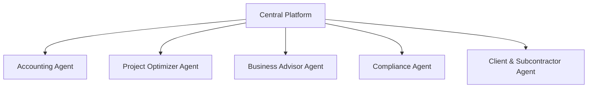

### AI Agent Architecture

### Competitive Comparison

| Feature | Standard Software | Our AI-Powered Platform |
| :--- | :--- | :--- |
| **Budgeting** | Manual templates, cost databases | AI predicts costs based on historical data and market trends |
| **Compliance** | User must track rules | AI agent flags issues, prepares tax filings automatically |
| **Reporting** | Generates historical reports | AI provides predictive insights and strategic advice |
